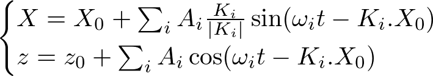
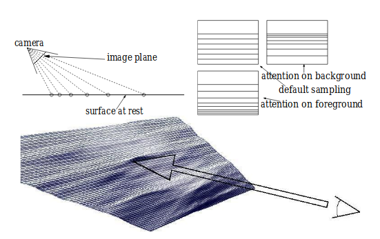
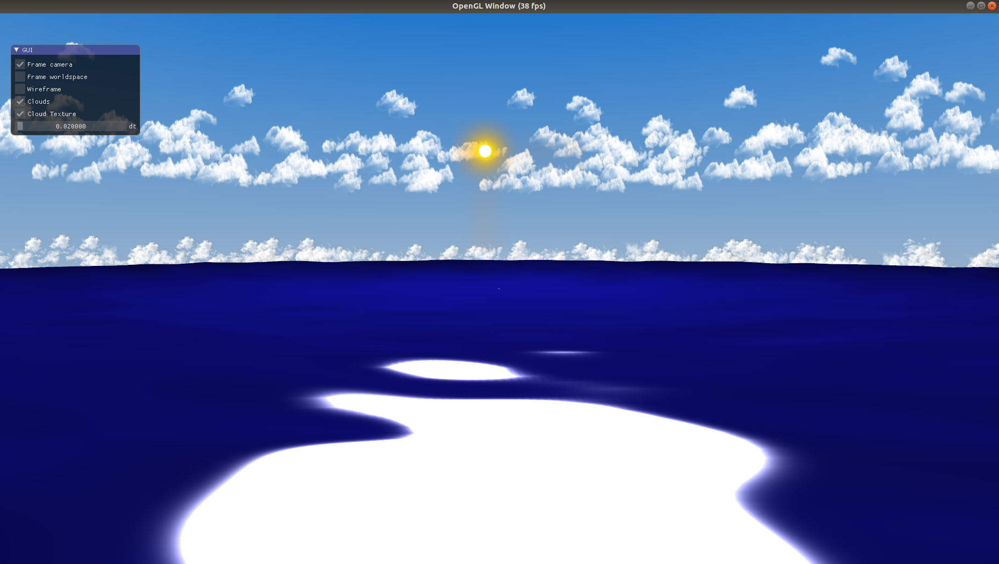

# **INF443 Project**: Simulating Adapeted Gerstner Waves

## Introduction

Our project of choice was inspired by the polycopy of simulation of natural events, which showcased the results of a dynamically adapted Gerstner model ocean. We based our implementation on the paper cited by the course, [Interactive Animation of Ocean Waves (HISSINGER et al, 2002)](https://hal.inria.fr/inria-00537490/document). We used the VCL enviroment (and [library](https://bitbucket.org/mbredif/vcl/src/master/)) to develop this project.

## Theory
### Gerstner Waves

The Gerstner model for waves usually results in a more realistic simulation than other options such as sine wave mixture. For the simulation, the ocean's surface is considered as consisting of particles which follow the following equations:



In which X is a vector on the ocean's plane where the particle is and z is the height of the particle. X_0 and z_0 represent the position where the particle would rest if there were no waves. By writing the surface's equation in function of the parameters X_0 and z_0, we can take the spatial calculate its gradient and, as a result, the unit normal vector to the surface analytically.

We can see from the equation that each wave train can be determined by an amplitude, a velocity and a frequency. One crucial information that was missing from the original article was how these three variables are related in a realistic model.

After some research, we decided to follow the equations given in [this write-up on the simulation of irregular waves using MATLAB](http://www.smart-coding.net/irwave/).

### Dynamically Optimal Meshes (with raytracing)

The paper details the technique of creating *dynamically optimal* mesh structures the render the ocean. This works by projecting rays from the camera and only adding vertices to where the rays collide with the plane representing the ocean at rest. The next image, which was taken from the original paper, illustrates the process:



This has the benefit of simulating the ocean only where it can be seen, with a finer mesh size on the parts that are closer to the user and rougher meshes away from the user. However, as a result, we cannot rely on sampling to calculate the normals at each vertex, which is why we took the time to calculate analytical normals previously.

## Implementation

The ocean simulation algorithm can be summarized with the following pseudocode:

```pseudocode
let P be the plane representing the still ocean
let RG be a grid of rays of height x width rays
let M be the mesh represing the ocean

for each instant t:
    update RG to store the rays projected from the camera at the instant t

    for each ray R in RG:
        intersect R with P
        simulate a ocean surface particle at the intersection
        set a vertice from M at the particle position

    render M
```

Given that there are `W` waves, the runtime complexity of this algorithm will be O ( `width` * `height` * `W` ). 

In practice, we do not generate a ray for each pixel, as it is too costly to run in realtime. We also used a mesh of fixed size to represent the ocean and updated its vertex positions and normal to the VBO at each instant.

We ran into a problem regarding what to do with rays which failed to intersect with the ocean plane (even a point that would normally intersect sometimes failed because the intersection point was far away from the origin). This was a problem because our fixed mesh meant that we had to place a the vertex *somewhere* that didn't disrupt the simulation. The chosen solution was to consider rays that failed to intersect to have an intersection point at *infinity*, which, for our purposes, is just beyond the maximum render distance.

For creating wave trains, most simulations we found manually select them. We chose to automatically simulate them in a range of frequencies. Given a frequency and a direction, we determine its amplitude and velocity using the equations relations mentioned earlier (we suppose a initial wind velocity of 50 m/s).

We also chose to add a few elements so the scene feels more realistic. We have construted a cylindrical skybox with billboard clouds and a billboard sun.

## Results

The current state of the project is the following:



Not great. After a seraching how to render realistic-looking water, we realized that there is *a lot* of work and thought to be put on the shaders (we found good resources on the subject, such as [this tutorial on OpenGl water shaders](https://blog.bonzaisoftware.com/tnp/gl-water-tutorial/) and [this Unity shaders tutorial for water](https://catlikecoding.com/unity/tutorials/flow/looking-through-water/)).

Unforunately, we did not have the time to get into writing glsl shaders to present a more beautifull looking final result. Nevertheless, we believe our initial objective of employing the simulation techniques introduced by the paper that served as inspiration.
